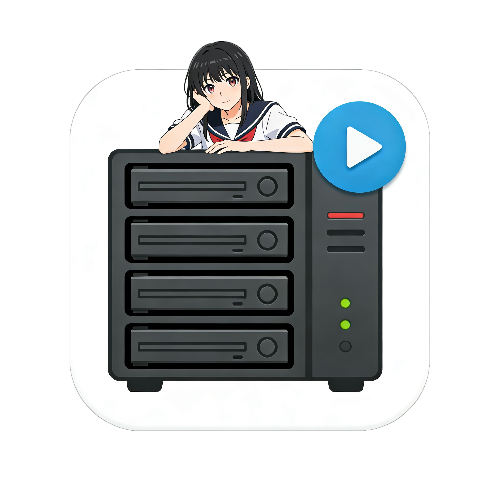
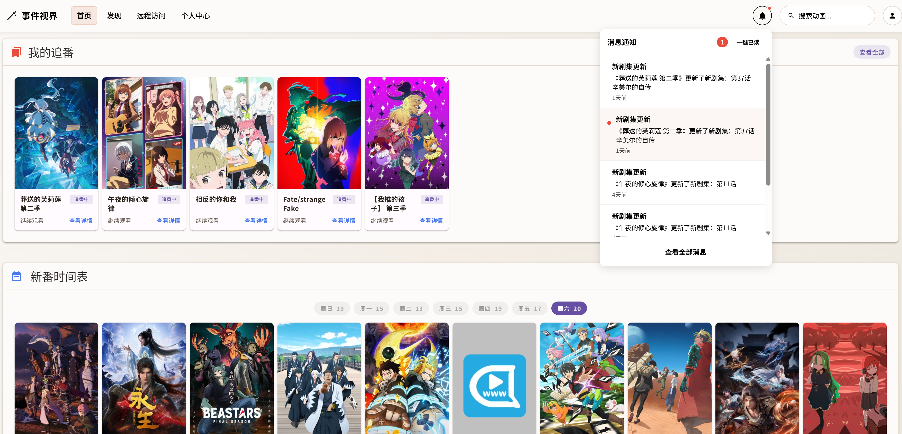
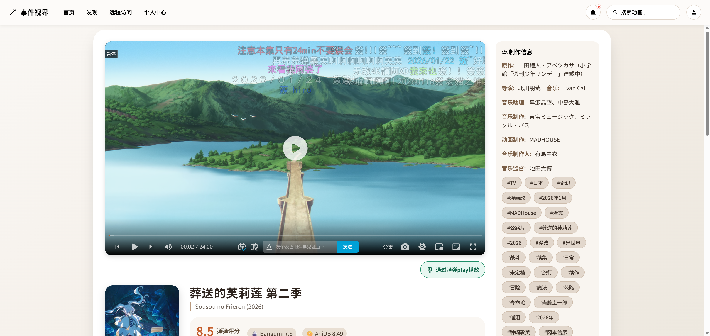
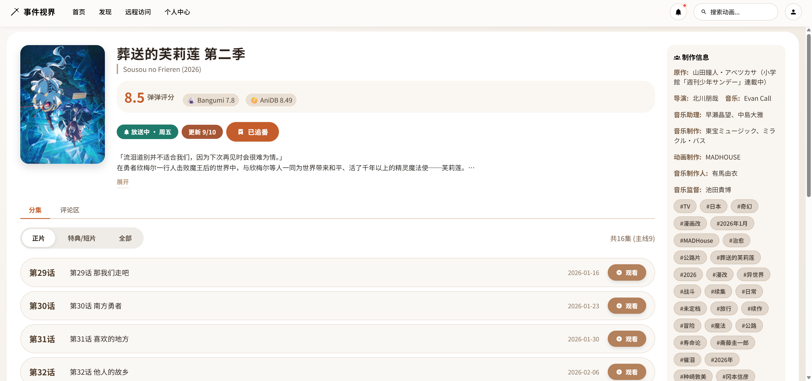
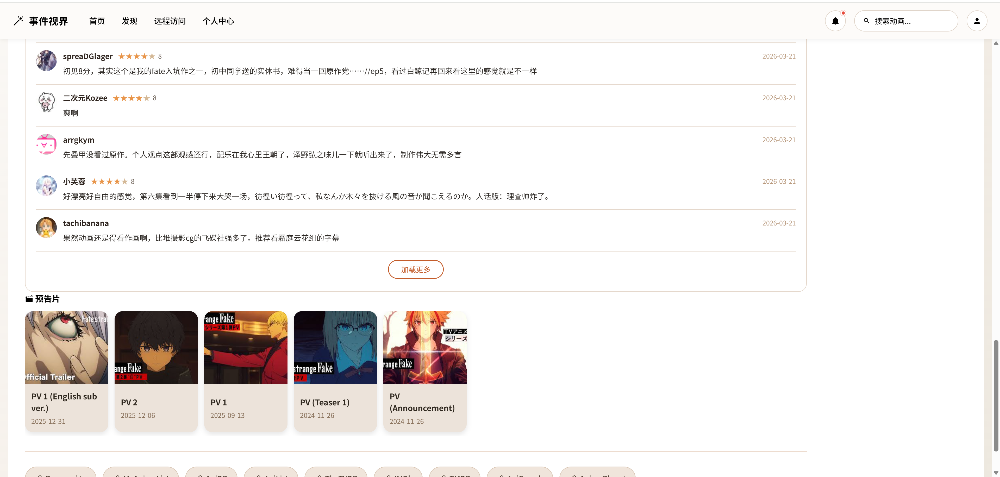
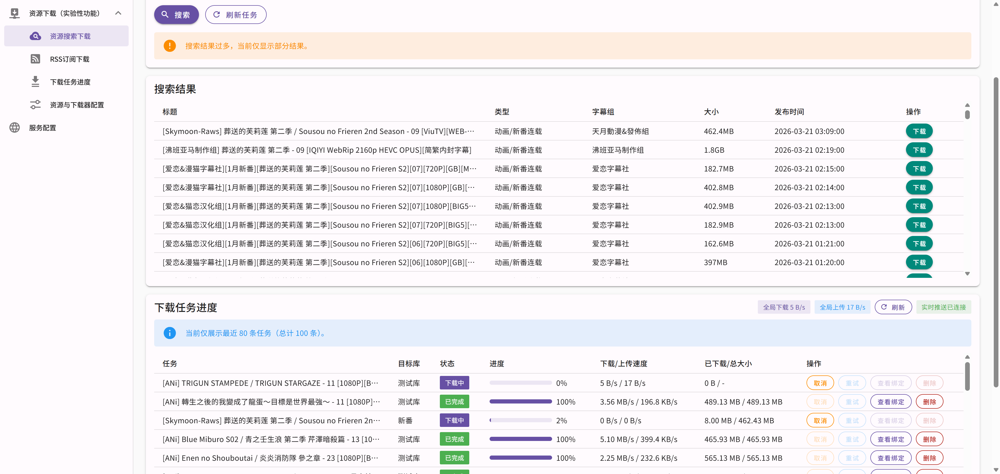
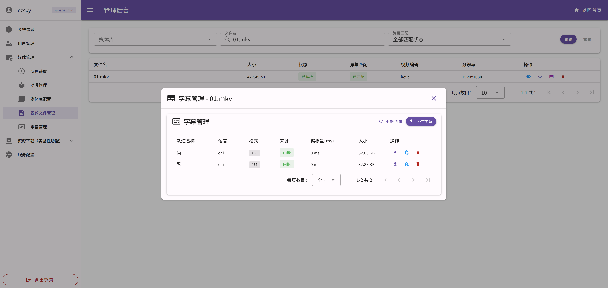

<div align="center">
  <h1>
    
    <span valign="middle">AniLinkService</span>
  </h1>
</div>

基于弹弹play开放平台的本地追番服务，面向有 NAS、家用服务器或轻量云主机的用户，提供媒体库扫描、番剧匹配、弹幕播放、RSS 自动下载、追番通知和后台管理等能力。


完整文档站点：https://eventhorizonsky.github.io/ani-link-doc/

## 项目定位

AniLinkService 适合这类场景：

- 你有一台可以持续运行的 NAS 或家用服务器
- 你希望把本地番剧文件、弹幕、追番和自动下载整合到一个服务里
- 你可以使用 Docker，或具备基本的 Java / Node 本地开发环境
- 你的环境可以访问 `ghcr.io`
- 你已经申请到弹弹开放平台的 `AppId` 和 `AppSecret`

如果你只有一台电脑或手机，希望直接开箱即用，弹弹官方客户端通常会更合适：
https://www.dandanplay.com/


## 界面预览

<table>
  <tr>
    <td align="center" width="50%">
      
      <br />
      <sub>首页：新番时间表与常用入口</sub>
    </td>
    <td align="center" width="50%">
      
      <br />
      <sub>播放页：视频、弹幕与字幕联动</sub>
    </td>
  </tr>
  <tr>
    <td align="center" width="50%">
      
      <br />
      <sub>番剧详情：海报、剧集与追番信息</sub>
    </td>
    <td align="center" width="50%">
      
      <br />
      <sub>评论区：聚合 Bangumi 讨论内容</sub>
    </td>
  </tr>
  <tr>
    <td align="center" width="50%">
      
      <br />
      <sub>后台：资源搜索、下载和管理</sub>
    </td>
    <td align="center" width="50%">
      
      <br />
      <sub>后台：内封、外挂字幕管理</sub>
    </td>
  </tr>
</table>


## 核心能力

- 首次安装向导，初始化站点信息、管理员账号和媒体库
- 本地媒体库扫描，支持常见视频格式，自动监听文件变化
- 基于弹弹接口进行番剧与剧集匹配，支持重匹配
- 播放页集成弹幕、字幕与播放进度记录
- 番剧详情页展示新番时间表、剧集、评论和追番状态
- RSS 订阅下载，支持代理、立即检查和自动入库匹配
- 后台管理包含媒体库、视频文件、字幕、下载任务、RSS 和系统配置
- 支持 H2 快速启动，也支持 PostgreSQL 部署

## 快速开始

### 前置条件

启动前建议先确认：

1. 服务器已安装 Docker，并且你知道如何创建和管理容器
2. 机器可以拉取 `ghcr.io/eventhorizonsky/anilinkserver:latest`
3. 你已拿到弹弹开放平台的 `AppId` 和 `AppSecret`

开放平台申请指引：
https://doc.dandanplay.com/open/#_3-申请-appid-和-appsecret

### 1. 拉取镜像

```bash
docker pull ghcr.io/eventhorizonsky/anilinkserver:latest
```

### 2. 使用 H2 快速启动

先进入你希望持久化数据和媒体文件的目录：

```bash
mkdir -p ./anilink/data ./anilink/media
```

然后启动容器：

```bash
docker run -d \
  --name anilink \
  -p 8081:8081 \
  -e DB_PROFILE=h2 \
  -v ./anilink/data:/data \
  -v ./anilink/media:/media/anime \
  --restart unless-stopped \
  ghcr.io/eventhorizonsky/anilinkserver:latest
```

说明：

- `./anilink/data` 用于持久化 H2 数据库、缓存和临时文件
- `./anilink/media` 是示例媒体目录，会挂载到容器内的 `/media/anime`
- `-p 8081:8081` 左侧是宿主机端口，可改；右侧容器端口固定为 `8081`

### 3. 完成初始化

容器启动后，浏览器访问：

```text
http://<你的主机IP>:8081
```

按照安装向导依次完成：

1. 站点标题、描述和管理员账号配置
2. 弹弹开放平台 `AppId` / `AppSecret` 配置
3. 媒体库路径配置

如果你使用的是上面的 Docker 命令，媒体库路径应填写：

```text
/media/anime
```

初始化完成后，首页应能正常显示新番时间表；如果数据异常，优先检查 `AppId` 和 `AppSecret` 是否填写正确。

### 4. 配置自动下载

如果你的媒体库中已经有视频文件，这一步可以跳过。

进入后台管理后，可以在 RSS 订阅中添加订阅地址，例如：

```text
https://acg.rip/team/173.xml
```

支持的典型流程：

- 新增 RSS 订阅
- 按需配置 HTTP 代理
- 点击“立即检查”触发抓取
- 自动下载到媒体库并完成匹配

回到首页的“发现”页后，应能看到刚刚匹配成功的番剧。

## 部署说明

### PostgreSQL

默认数据库为 H2。如需切换 PostgreSQL，可设置：

```bash
-e DB_PROFILE=pgsql
-e DB_HOST=127.0.0.1
-e DB_PORT=5432
-e DB_NAME=anilink
-e DB_USER=postgres
-e DB_PASS=yourpassword
```

示例：

```bash
docker run -d \
  --name anilink \
  -p 8081:8081 \
  -e DB_PROFILE=pgsql \
  -e DB_HOST=192.168.1.100 \
  -e DB_PORT=5432 \
  -e DB_NAME=anilink \
  -e DB_USER=postgres \
  -e DB_PASS=yourpassword \
  -v ./anilink/media:/media/anime \
  --restart unless-stopped \
  ghcr.io/eventhorizonsky/anilinkserver:latest
```

### 自建镜像

如果你希望从源码构建镜像：

```bash
docker build -t anilink-service .
```

## 本地开发

### 环境要求

- JDK 17+
- Maven 3.8+
- Node.js 18+
- pnpm
- `ffprobe` 可执行文件

### 启动后端

```bash
cd api
mvn spring-boot:run
```

默认使用 H2。如需 PostgreSQL：

```bash
cd api
DB_PROFILE=pgsql mvn spring-boot:run
```

### 启动前端

```bash
cd ui
pnpm install
pnpm dev
```

### 目录结构

```text
api/   Spring Boot 后端
ui/    Vue 3 + Vite 前端
data/  默认数据目录
```

## 文档

- 完整文档站点：https://eventhorizonsky.github.io/ani-link-doc/
- 弹弹开放平台文档：https://doc.dandanplay.com/open/
- Swagger UI：服务启动后访问 `http://localhost:8081/swagger-ui/index.html`

README 只保留项目概览和常用启动方式；更详细的部署、配置和界面引导建议查看完整文档站点。

## 故障排查

- 无法访问页面：检查 `-p 8081:8081` 映射和服务器防火墙
- 扫描不到视频：确认媒体目录已正确挂载，且安装向导中填写的是容器内路径
- 启动失败：先查看容器日志 `docker logs anilink`
- 新番时间表或基础功能异常：优先检查弹弹开放平台 `AppId` / `AppSecret`

## 技术栈

- 后端：Spring Boot 3.4.x、Spring Data JPA、Liquibase、Sa-Token、SpringDoc OpenAPI
- 数据库：H2 / PostgreSQL
- 前端：Vue 3、Vite、Vuetify、Vue Router、Axios
- 播放器：Artplayer、artplayer-plugin-danmuku
- 媒体分析：FFmpeg / ffprobe
- 下载组件：jlibtorrent

## 致谢

- Sa-Token: https://sa-token.cc/
- FFmpeg: https://ffmpeg.org/
- dandanplay 开放平台: https://doc.dandanplay.com/open/
- Artplayer: https://artplayer.org/
- artplayer-plugin-danmuku: https://github.com/zhw2590582/ArtPlayer/tree/master/packages/artplayer-plugin-danmuku
- jlibtorrent: https://github.com/frostwire/frostwire-jlibtorrent
- bangumi: https://bangumi.tv/dev